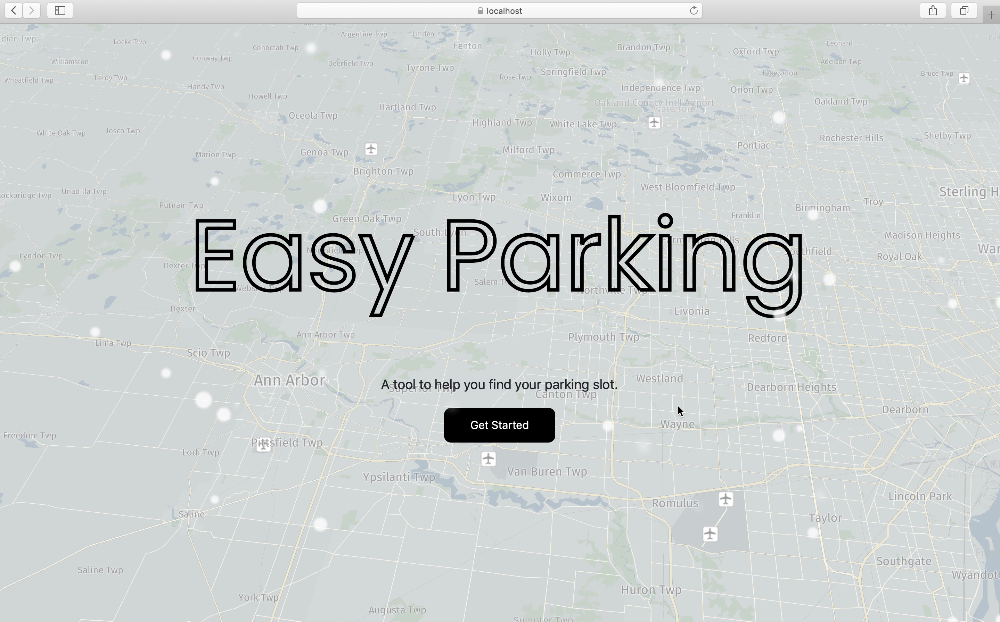
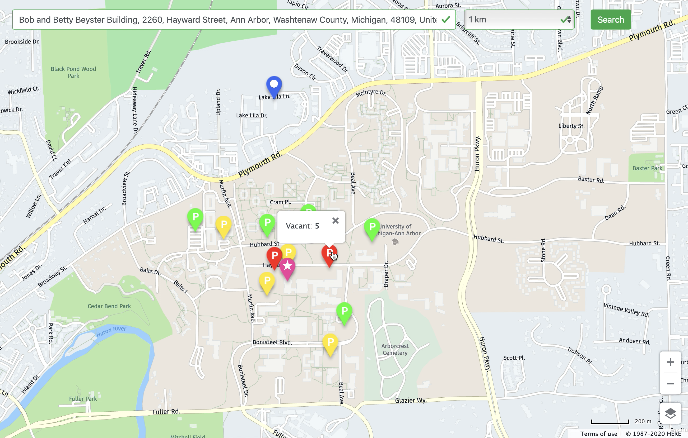
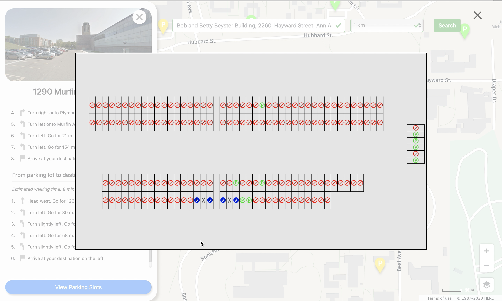

# Easy Parking
A tool to help you find your parking slot.

### Overview

*The home page of our app.*

*A screen shot of the parks relevant to the search.*

*A screen shot of the layout of a certain park.*

### Frameworks Used
- React
- Bootstrap
- Express
- Node.js
- Webpack

### How To Run
1. If you haven't installed `node.js`, go to `node.js`'s official website to download the installation package.
2. Run `npm install .` to install all the necessary packages.
3. Populate the database: Run `npm run migration`. If you see any errors, just ignore them.
4. Run `npm run start` to start the application.
5. Go to `localhost:3000` to access the application. If your browser blocks you from obtaining your geographical location due to security issues, which prevents our application from running properly, go to `https://localhost:8443` for the https version. You need to choose "proceed" anyway though your browser may warn you that it is not secure.
6. Enjoy.
